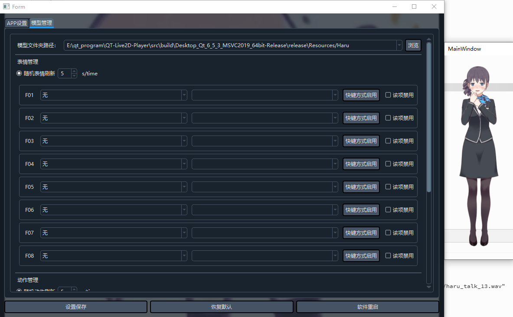

# QT-Live2D-Player

## Introduction
```
This is a Live2D model control software developed based on Qt 6.5.3. 
It supports reading official moc3.json files to achieve customized management of actions and expressions. 
More features will be added gradually. Stay tuned.
```

## driver
The model is rendered via OpenGL and driven using the official Live2D SDK.


## Control mode : mouse and key
Currently only mouse and keyboard shortcut controls are supported, which can be adjusted on the settings page. 



More features coming soon.