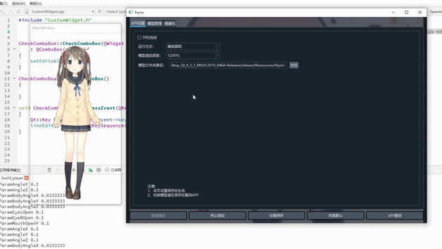
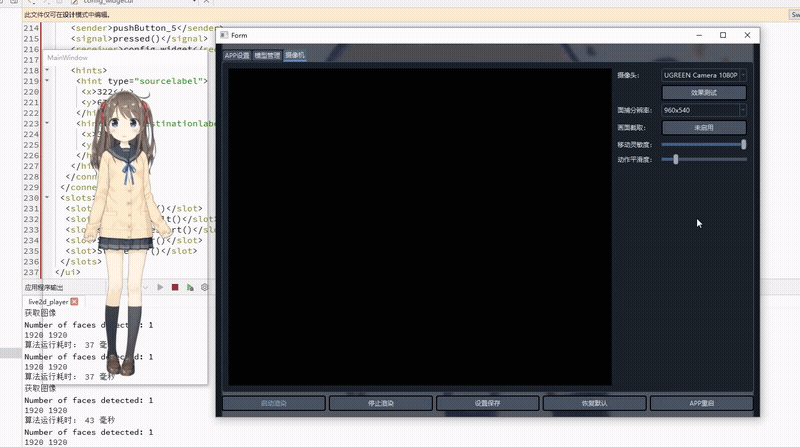

# QT-Live2D-Player

## Introduction
```
这是一个用Cubsim SDK驱动的Live2d模型控制软件
软件采用C++QT作为主体框架
```


## 操控模式
可通过APP设置界面选择操控模式
## ①鼠标跟随（v1.0）


## ②面部跟随（v2.0）

```
基于实时机器学习人脸关键点检测实现，可通过分辨率输入和采集图像裁剪进行人脸检测调整
```

## 自定义功能
软件会读取相关文件对表情动作进行管理，可自定义操控形式进行表情动作切换（功能未完善）
## 区域点击+按键感应 
点击区域与模型内部设置相关
自定义按键进行表情动作切换


## 后续更多功能尽请期待